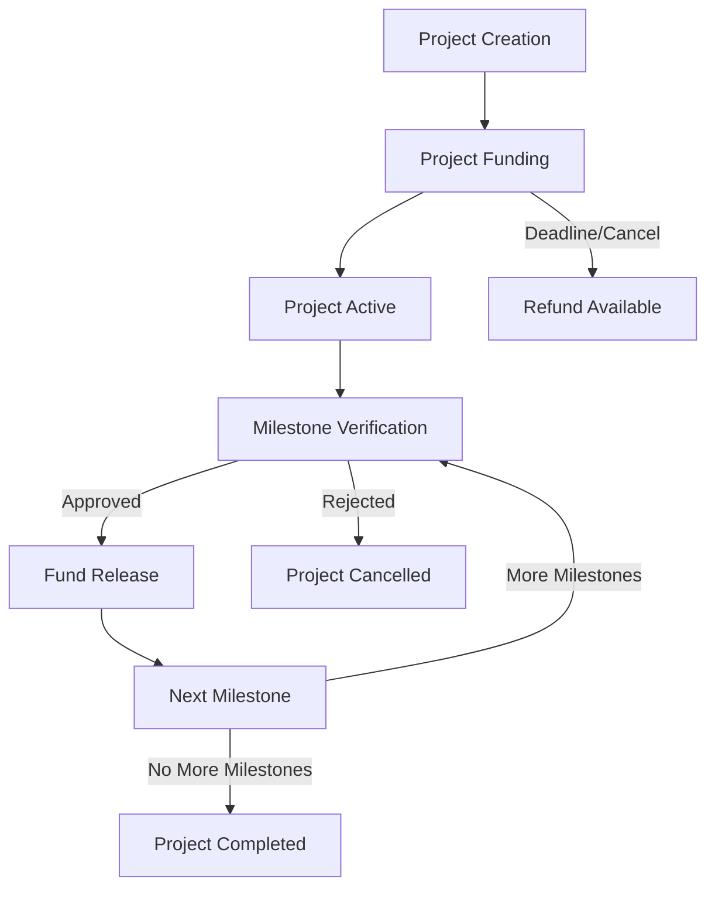

# CreatorTide: Milestone-Based Funding Platform

A decentralized funding platform that enables supporters to back creative projects with milestone-based fund releases, ensuring accountability and alignment between creators and backers.

## Overview

CreatorTide introduces a phased funding release system where creators receive portions of their funding only after demonstrating progress on predefined milestones. This approach differs from traditional all-or-nothing crowdfunding by:

- Breaking projects into verifiable milestones
- Releasing funds incrementally based on progress
- Offering two verification methods: community voting or trusted reviewers
- Protecting backers through staged releases
- Maintaining creator motivation through continued funding



## Architecture

The platform is built on a single smart contract that manages:

1. Project Registration and Configuration
2. Funding Collection and Management
3. Milestone Tracking and Verification
4. Fund Distribution
5. Refund Mechanisms

### Key Components

- **Projects**: Core data structure tracking project details, funding status, and milestone progress
- **Milestones**: Individual project phases with specific deliverables and funding allocations
- **Verification Systems**: Dual approach supporting either community voting or trusted reviewer validation
- **Fund Management**: Secure handling of STX tokens with platform fee processing
- **Backer Protection**: Built-in refund mechanisms for failed or cancelled projects

## Contract Documentation

### Core Functionality

#### Project Management
- `create-project`: Initialize a new project with basic details
- `add-milestone`: Define project milestones and their requirements
- `activate-project`: Begin the funding phase
- `cancel-project`: Cancel a project during funding phase

#### Funding Operations
- `back-project`: Support a project with STX
- `request-refund`: Retrieve funds from failed/cancelled projects

#### Milestone Verification
- `submit-milestone-for-verification`: Submit completed milestone work
- `vote-on-milestone`: Community voting on milestone completion
- `reviewer-approve-milestone`: Trusted reviewer verification
- `release-milestone-funds`: Release funds after milestone approval

### Access Control

- Project creators can manage their own projects
- Backers can vote on milestones (in voting-based projects)
- Designated reviewers can approve milestones (in reviewer-based projects)
- Platform-wide operations are protected by appropriate checks

## Getting Started

### Prerequisites

- Clarinet
- Stacks Wallet
- STX tokens for testing

### Installation

1. Clone the repository
2. Install dependencies with Clarinet
3. Deploy contract to your chosen network

### Basic Usage

```clarity
;; Create a new project
(contract-call? .creator-tide create-project 
    "My Project" 
    "Description" 
    u1000000 ;; 1M uSTX funding goal
    u0 ;; Voting-based verification
    u1000) ;; Funding deadline block height

;; Add a milestone
(contract-call? .creator-tide add-milestone 
    u1 ;; Project ID
    "Milestone 1" 
    "Description" 
    u30 ;; 30% of total funding
    u2000) ;; Deadline block height

;; Back a project
(contract-call? .creator-tide back-project 
    u1 ;; Project ID
    u100000) ;; 100k uSTX backing amount
```

## Function Reference

### Project Creation and Management

```clarity
(create-project (title (string-ascii 100)) 
                (description (string-utf8 1000)) 
                (funding-goal uint)
                (verification-type uint)
                (funding-deadline uint))
                
(add-milestone (project-id uint)
               (title (string-ascii 100))
               (description (string-utf8 500))
               (percentage uint)
               (deadline uint))
               
(activate-project (project-id uint))
```

### Funding Operations

```clarity
(back-project (project-id uint) (amount uint))
(request-refund (project-id uint))
```

### Milestone Management

```clarity
(submit-milestone-for-verification (project-id uint) (milestone-index uint))
(vote-on-milestone (project-id uint) (milestone-index uint) (approve bool))
(reviewer-approve-milestone (project-id uint) (milestone-index uint))
(release-milestone-funds (project-id uint) (milestone-index uint))
```

## Development

### Testing

Run tests using Clarinet:

```bash
clarinet test
```

### Local Development

1. Start Clarinet console:
```bash
clarinet console
```

2. Deploy contract:
```clarity
(contract-call? .creator-tide ...)
```

## Security Considerations

### Platform Safeguards

- Funds are held in contract until milestone completion
- Multiple verification methods for different trust requirements
- Built-in deadline enforcement
- Refund mechanisms for failed projects

### Limitations

- Project creators must complete milestones sequentially
- Refunds only available after project failure/cancellation
- Platform fees are non-refundable
- Milestone voting/approval decisions are permanent